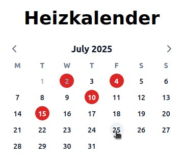

# Heating calendar

This simple web app shows a calendar of the current month and allows the user to select days on which the heater should be turned on. The idea of this app is that the user selects the home office days so that the heating of the home office is only turned on when the user works from home. This repo contains the following parts:

## heating_calendar_frontend

Frontend of the heating calendar web app based on vue + tailwind. The app has a simple responsive design.

## heating_calendar_db

Instructions for the surrealdb backend that stores the current heating days and handles authentication.

## homematic_control

Python based service that wakes up every day in the morning to check whether the heater should be turned on. If so the heater is turned on by calling the Homematic API accordingly.